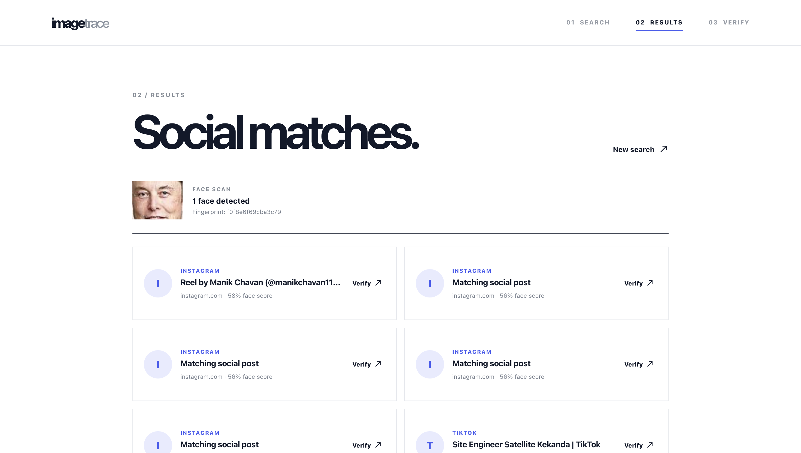

# Face Identification & Blockchain Verification

Face Trace is an HH Goa 2026 Task 3 project that detects a face in a public image, finds related social-media results, and creates a tamper-evident on-chain evidence record.

## Demo

### 1. Dashboard

The landing dashboard introduces the three-step workflow: search, choose a result, and verify the evidence.


### 2. Search

Paste a public image URL. Face Trace detects and encodes the largest face before running Google Lens and Yandex reverse-image searches.


### 3. Results

The application filters search results for social platforms and ranks the matching posts. Select one result to use as evidence.



### 4. Verify

Click **Record on blockchain** to create an on-chain evidence record. Click **Verify record** to recompute the fingerprint and compare it with the on-chain record.


### 5. Post found — Elon Musk on Instagram

This example shows a social-media post found for the Elon Musk search image.


A successful verification means the selected evidence has exactly the same face fingerprint, URL, thumbnail URL, and title as the record. Selecting another result changes the SHA-256 fingerprint and produces **Not verified**.

## How to run

Install dependencies:

```bash
python3 -m pip install -r backend/requirements.txt
cd frontend && npm install
cd ../blockchain && npm install
```

Start the local Hardhat Ethereum network in terminal one:

```bash
cd blockchain
npm run node
```

In terminal two, create the local configuration and deploy the contract:

```bash
cd blockchain
cp .env.example .env
# Add EVIDENCE_SIGNER_PRIVATE_KEY=<a local Hardhat private key printed by npm run node>
npm run deploy
```

Deployment generates `blockchain/deployment.json`, which is read automatically by the API.

In terminal three, start the backend:

```bash
python3 backend/server.py
```

In terminal four, start the frontend:

```bash
cd frontend
npm run dev
```

Open the Vite URL printed in the terminal, normally `http://localhost:5173`.

If ChromeDriver is installed somewhere other than `chromedriver-mac-arm64/chromedriver`, set `CHROMEDRIVER_PATH` to its executable path.

## Tech stack

- **Frontend:** React, Vite
- **Backend:** Python, FastAPI, OpenCV, Selenium, Beautiful Soup, Requests, Web3.py
- **Search:** Google Lens and Yandex reverse-image search
- **Blockchain:** Solidity, Hardhat local Ethereum network, `EvidenceRegistry.sol`
- **Evidence format:** SHA-256 over stable JSON containing the face fingerprint, source URL, thumbnail URL, and title

### Project layout

```text
HH-Goa/
├── frontend/     # React / Vite user interface
├── backend/      # FastAPI app and Python face-search pipeline
├── blockchain/   # Hardhat contract and deployment scripts
├── Demo/         # README walkthrough screenshots
├── data/         # generated local images, face crops, and search results
└── README.md
```

### Known limitations and responsible use

- Use only public images and material you are authorized to process. Do not use this for surveillance or non-consensual identification.
- Search engines can rate-limit or block automated requests, or return no social-media result.
- A public image URL is required for live reverse-image search. Local uploads can be face-scanned but cannot be sent to Lens or Yandex.
- The OpenCV encoding is a demo-ranking signal, not production biometric recognition.
- Hardhat is a local simulated Ethereum network. Restarting it clears all evidence records, so the contract must be deployed again.
